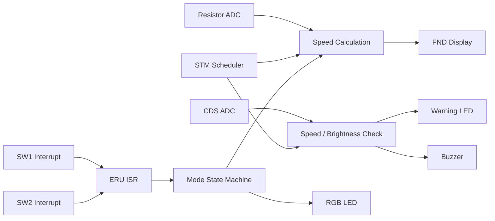
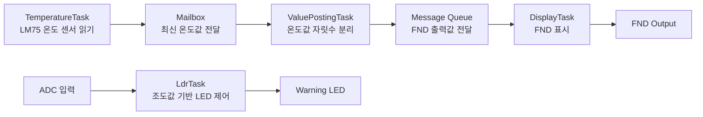
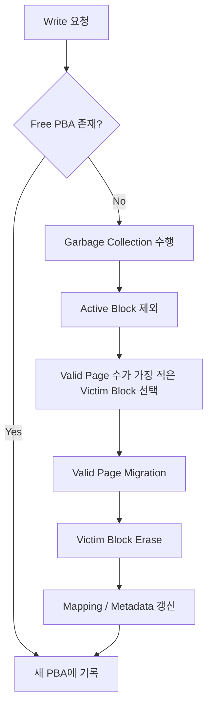

# 김태용 (Tae Yong Kim)

**Embedded & System Software Engineer**  
[Email](mailto:ktyong1225@inha.edu)  |  [GitHub](https://github.com/ttaeyong)

C/C++ 기반의 임베디드·시스템 소프트웨어를 설계하고 구현해왔습니다.  
주기 태스크, 인터럽트, IPC, 상태기계, 하드웨어 제약을 고려해 실시간 제어 흐름을 구조화하는 데 강점이 있으며, 구현뿐 아니라 검증 가능한 형태로 시스템을 설계하는 개발자를 지향합니다.

---

## Core Strength

- **Real-time Control SW**: 주기 태스크 설계, 인터럽트 처리, 상태기계 기반 제어
- **Embedded SW Design**: 센서 입력, 제어 판단, 출력 반영 구조 설계
- **RTOS / Concurrency**: uC/OS-II 태스크 분리, Mailbox / Queue 기반 IPC 설계
- **SW Verification Mindset**: 입력-처리-출력 흐름 기준으로 동작 조건과 결과 점검
- **Low-level Implementation**: ADC, I2C(TWI), FND, LED, Flash 내부 로직 구현
- **System-level Analysis**: 성능 병목 분석, 자원 흐름 해석, 하드웨어 제약 기반 최적화

---

## 1. 요구사항 기반 실시간 제어 시스템

**Infineon AURIX TC275**

### Overview

AURIX TC275 보드 기반으로 차량 속도 제어, 조도 감지, 과속 경고, 비상 모드 전환을 수행하는 실시간 제어 시스템입니다.  
핵심은 기능 구현 자체보다, **요구사항을 주기 태스크와 이벤트 처리 구조로 분해하고 이를 상태기계 기반 제어 로직으로 연결한 점**에 있습니다.

### My Role

- 1ms / 10ms / 100ms / 1000ms 주기 태스크 구조 설계
- STM compare interrupt 기반 스케줄 플래그 관리 로직 구현
- ERU interrupt 기반 스위치 이벤트 처리
- ADC 드라이버 및 FND 출력용 shift-out 로직 구현
- NORMAL / CRUISE / EMERGENCY 상태기계 설계 및 제어 로직 구현

### Key Design Decisions

- **비선점형 주기 태스크 구조**
  - 1ms: 속도 처리, FND 표시
  - 10ms: ADC 입력 취득
  - 100ms: 과속/조도/모드 표시 로직
  - 1000ms: 저주기 상태 점검

- **이벤트와 제어 로직 분리**
  - 스위치 입력은 ERU interrupt로 감지
  - 실제 상태 전환은 main loop에서 처리해 제어 흐름 일관성 유지

- **상태기계 기반 모드 관리**
  - NORMAL / CRUISE / EMERGENCY 모드 분리
  - 입력과 조건에 따라 출력 동작이 달라지도록 설계

### Verification

- 일반 / 크루즈 / 비상 모드 전환이 요구사항대로 수행되는지 확인
- ADC 입력 변화가 속도 및 조도 판단 결과에 반영되는지 점검
- 과속 시 LED / Buzzer 경고가 정상적으로 출력되는지 확인
- 인터럽트에서 이벤트를 감지하고 main loop에서 상태 전환이 처리되는 흐름을 검증

### Result

- 요구사항을 **주기 태스크, 인터럽트, 상태 전이, 출력 제어**로 분해해 구현
- 실시간 제어 SW에서 중요한 **입력 처리, 이벤트 반영, 상태 기반 제어 구조**를 직접 설계

### Job Relevance

실시간 운영체제 기반 제어 SW, 임베디드 응용 SW, 구성 장비 제어/연동 SW 개발과 직접적으로 연결되는 경험입니다.

### Skills / Keywords

`C` `AURIX TC275` `STM Interrupt` `ERU Interrupt` `ADC` `State Machine` `Real-time Scheduling` `Driver Development`

### Periodic Task Design

| 주기 | Task | 주요 역할 |
|---|---|---|
| 1ms | AppTask1ms | 속도 처리, FND 표시 |
| 10ms | AppTask10ms | ADC 입력 취득 |
| 100ms | AppTask100ms | 과속 경고, 조도 확인, 현재 모드 표시 |
| 1000ms | AppTask1000ms | 저주기 상태 점검 |

### Input / Processing / Output Flow



<details> <summary><b>구현 개요 및 핵심 코드 보기</b></summary> <div markdown="1">

### 구현 개요

1.  요구사항을 1/10/100/1000ms 태스크로 분해
    
2.  STM compare interrupt에서 scheduling flag 설정
    
3.  ERU interrupt로 스위치 이벤트 감지
    
4.  ADC 결과를 바탕으로 속도/조도 처리
    
5.  상태기계 기반 NORMAL / CRUISE / EMERGENCY 모드 전환
    
6.  FND와 LED/Buzzer 출력 반영
    

### 핵심 코드 예시

```C
void  AppScheduling(void)  
{  
  if (stSchedulingInfo.u8nuScheduling1msFlag  ==  1u)  
 {  
  stSchedulingInfo.u8nuScheduling1msFlag  =  0u;  
  AppTask1ms();  
 }  
  if (stSchedulingInfo.u8nuScheduling10msFlag  ==  1u)  
 {  
  stSchedulingInfo.u8nuScheduling10msFlag  =  0u;  
  AppTask10ms();  
 }  
  if (stSchedulingInfo.u8nuScheduling100msFlag  ==  1u)  
 {  
  stSchedulingInfo.u8nuScheduling100msFlag  =  0u;  
  AppTask100ms();  
 }  
  if (stSchedulingInfo.u8nuScheduling1000msFlag  ==  1u)  
 {  
  stSchedulingInfo.u8nuScheduling1000msFlag  =  0u;  
  AppTask1000ms();  
 }  
}
```

</div> </details>

----------

## 2. RTOS 기반 센서 모니터링 및 경보 시스템

**ATmega128 + uC/OS-II**

### Overview

ATmega128과 uC/OS-II 기반으로 온도 및 조도 센서를 주기적으로 수집하고, 위험 온도 판단 및 LED/FND 출력을 수행한 프로젝트입니다.  
핵심은  **센서 입력, 판단, 출력 태스크를 분리하고 목적에 맞는 IPC를 설계해 데이터 흐름을 구성한 점**입니다.

### My Role

-   전체 태스크 구조 설계
    
-   센서 입력 / 판단 / 출력 태스크 분리
    
-   Mailbox / Message Queue 기반 IPC 설계 및 구현
    
-   TWI(I2C), ADC, FND, LED 제어 로직 구현
    

### Task / IPC Design

-   **TemperatureTask**: LM75 온도 센서 수집
    
-   **ControlTempTask**: 온도 판단 및 경고 LED 제어
    
-   **ValuePostingTask**: 온도값 자릿수 분해 및 표시 데이터 생성
    
-   **DisplayTask**: FND 출력
    
-   **LdrTask**: 조도 기반 LED 제어
    

### Key Design Decisions

-   **Mailbox**
    
    -   최신 온도값 전달이 중요해 단일 최신값 공유에 사용
        
-   **Message Queue**
    
    -   FND 출력값은 순차 처리가 필요해 Queue로 전달
        
-   **태스크 책임 분리**
    
    -   입력 수집, 판단, 출력 역할을 분리해 RTOS 구조로 설계
        

### Verification

-   센서 입력 변화에 따라 경고 LED 동작이 정상 전환되는지 확인
    
-   Mailbox / Queue가 설계 의도에 맞게 동작하는지 점검
    
-   FND 표시 값이 온도 변화에 따라 정상 갱신되는지 확인
    

### Result

-   RTOS 환경에서  **태스크 분리, IPC 선택, 센서 처리, 출력 동기화**를 통합적으로 설계
    
-   운영체제 개념을 실제 임베디드 시스템의 실행 구조로 연결하는 경험 확보
    

### Job Relevance

실시간 시스템 제어/연동 SW 및 기반 SW 개발에서 중요한 태스크 구조 설계와 데이터 전달 방식 이해를 보여주는 경험입니다.

### Skills / Keywords

`C`  `ATmega128`  `uC/OS-II`  `RTOS`  `Mailbox`  `Message Queue`  `TWI(I2C)`  `ADC`  `FND`

### Task / IPC Flow



<details> <summary><b>구현 개요 및 핵심 코드 보기</b></summary> <div markdown="1">

### 구현 개요

1.  센서 입력 수집, 판단, 출력 태스크 분리
    
2.  온도 데이터는 Mailbox로 최신값 전달
    
3.  FND 출력용 데이터는 Queue로 순차 전달
    
4.  RTOS 기반으로 센서 입력과 디스플레이 출력을 병행 처리
    

### 핵심 코드 예시

```C
void  TemperatureTask(void  *pdata)  
{  
  INT16U  temp;  
  while (1)  
 {  
  temp  =  ReadLm75Temperature();  
  OSMboxPost(TempMbox, (void  *)temp);  
  OSTimeDlyHMSM(0, 0, 0, 100);  
 }  
}
```

</div> </details>

----------

## 3. 하드웨어 아키텍처 기반 GEMM 최적화

**Naive 구현 대비 성능 15.2배 향상**

### Overview

행렬 곱셈 성능을 높이기 위해 VTune으로 병목을 분석하고, 메모리 접근 구조와 레지스터 제약을 기준으로 최적화를 설계한 프로젝트입니다.  
단순히 기법을 추가하는 방식이 아니라,  **캐시 지역성·DRAM 접근·register pressure를 함께 고려해 최적 조합을 찾는 과정**에 집중했습니다.

### My Role

-   VTune 기반 병목 분석
    
-   loop reordering, blocking, SIMD, unrolling 실험 설계 및 비교
    
-   성능 변화 해석 및 최종 최적화 조합 설계
    

### Key Design Decisions

-   **Loop Reordering**:  `i-j-k`  →  `i-k-j`로 변경해 공간 지역성 개선
    
-   **Blocking**: cache 크기를 기준으로 block size 설정
    
-   **SIMD**: AVX-512 intrinsic 적용
    
-   **Unrolling 조정**: 과도한 unrolling이 register pressure와 spilling으로 이어질 수 있음을 고려해 범위 조정
    

### Verification

-   VTune에서  `Memory Bound`,  `L1 DTLB Overhead`,  `DRAM Bound`  비중 확인
    
-   thread 수 변화 실험으로 메모리 접근 경합 영향 점검
    
-   loop reordering 이후 DRAM 접근 감소 경향 확인
    
-   unrolling 적용 시 일부 구간의  `Clockticks`  증가와  `L1 Bound`  상승을 분석
    

### Result

-   Naive 구현 대비  **15.2배 성능 향상**
    
-   성능 최적화는 기법을 많이 넣는 것이 아니라,  **하드웨어 구조에 맞는 수준을 찾는 과정**임을 학습
    

### Job Relevance

직접적인 제어 SW 경험은 아니지만, 자원 제약과 병목을 분석하는 관점은 실시간 시스템에서 응답성과 처리 효율을 고려하는 데 활용할 수 있습니다.

### Skills / Keywords

`C++`  `Intel VTune Profiler`  `AVX-512`  `Loop Reordering`  `Blocking`  `Loop Unrolling`  `Cache Locality`  `Register Spilling`

### Optimization Pipeline

| Version | 핵심 아이디어 | 의미 |
| --- | --- | --- |
| Naive | 기본 구현 | baseline |
| Loop Reordering | `i-j-k → i-k-j` | 공간 지역성 개선 |
| Blocking | cache 크기 고려 | 메모리 병목 완화 |
| SIMD | AVX-512 적용 | 벡터 연산 병렬화 |
| Combined | 기법 결합 | 최종 15.2배 향상 |

### Performance Comparison


_Naive 구현 대비 성능 향상 배수입니다. 단일 기법만으로는 개선 폭이 제한적이었고,  
캐시 구조와 레지스터 제약을 함께 고려한 복합 최적화에서 가장 큰 성능 향상을 얻었습니다._

[VTune 병목 분석 보고서 확인 (PDF)](./assets/pdf/Profiling_VTune_Examples.pdf)  
[SIMD 및 복합 최적화 보고서 확인 (PDF)](./assets/pdf/Profiling_Matrix_Multiplication.pdf)

----------

## 4. NAND Flash Translation Layer (FTL) Emulator

**SSD Emulator**

### Overview

NAND Flash의 erase-before-write 제약을 고려해, logical address를 physical page로 변환하고 garbage collection을 수행하는 FTL 에뮬레이터입니다.  
mapping table, stale page, victim block, migration 흐름을 코드 수준에서 구현하며 저장장치 내부 동작을 분석했습니다.

### My Role

-   page-level mapping 구조 설계
    
-   `LtoP`,  `PtoL`  매핑 테이블 구현
    
-   out-of-place update 처리
    
-   greedy victim block 기반 garbage collection 구현
    
-   block metadata(valid count, erase count) 관리
    

### Key Design Decisions

-   **Page-level Mapping**
    
    -   overwrite 시 기존 physical page invalid 처리
        
-   **Out-of-place Update**
    
    -   새 free page에 기록 후 logical mapping 갱신
        
-   **Greedy Garbage Collection**
    
    -   active block을 제외하고 valid page 수가 가장 적은 block을 victim으로 선택
        
-   **Migration**
    
    -   valid page만 새 위치로 복사 후 erase 수행
        

### Verification

-   반복 write 시 기존 physical page가 invalid 처리되는지 확인
    
-   free page 고갈 시 victim block 선택과 migration이 정상 수행되는지 점검
    
-   erase 이후 metadata와 mapping table이 올바르게 갱신되는지 검증
    

### Result

-   page-level mapping, stale page 처리, victim selection, migration 흐름 구현
    
-   내부 상태와 자원 관리를 요구하는 시스템 소프트웨어 구조를 코드로 이해
    

### Job Relevance

복잡한 내부 상태를 일관되게 관리하는 경험은 구성 장비 SW나 시험 SW에서 필요한 상태 기반 로직 설계와 검증 관점으로 확장할 수 있습니다.

### Skills / Keywords

`C`  `FTL`  `Page Mapping`  `Out-of-place Update`  `Garbage Collection`  `Storage System`

### Garbage Collection Flow



----------

## **What I Learned Across Projects**

프로젝트를 수행하며 공통적으로 배운 점은, 시스템 소프트웨어 문제는 겉으로 보이는 기능보다 **내부 구조, 자원 흐름, 상태 관리 방식**에서 결정된다는 점입니다.

- 실시간 제어에서는 **주기 태스크, 인터럽트, 상태 전이**가 중요했습니다.
- RTOS 환경에서는 **태스크 책임 분리와 IPC 구조**가 핵심이었습니다.
- 성능 최적화에서는 **캐시, 메모리 접근, 레지스터 제약**이 병목을 결정했습니다.
- 저장장치 시스템에서는 **매핑, GC, 내부 상태 일관성**이 핵심이었습니다.

앞으로도 하드웨어와 소프트웨어 사이의 제약을 이해하고, 이를 제어·연동·검증 가능한 소프트웨어 구조로 구현하는 엔지니어로 성장하고자 합니다.

<script src="https://cdn.jsdelivr.net/npm/mermaid/dist/mermaid.min.js"></script> <script> window.onload = function() { mermaid.initialize({ startOnLoad: true }); mermaid.init(undefined, document.querySelectorAll('.language-mermaid')); }; </script>
