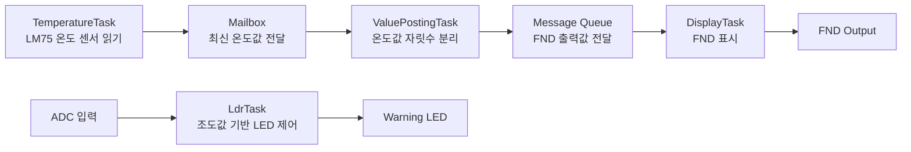
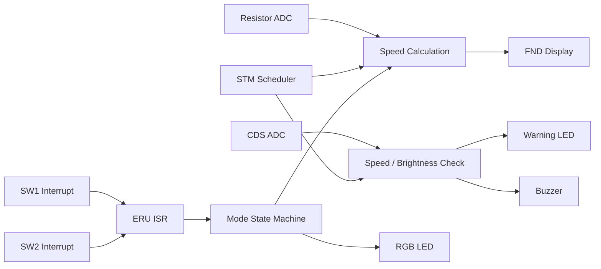
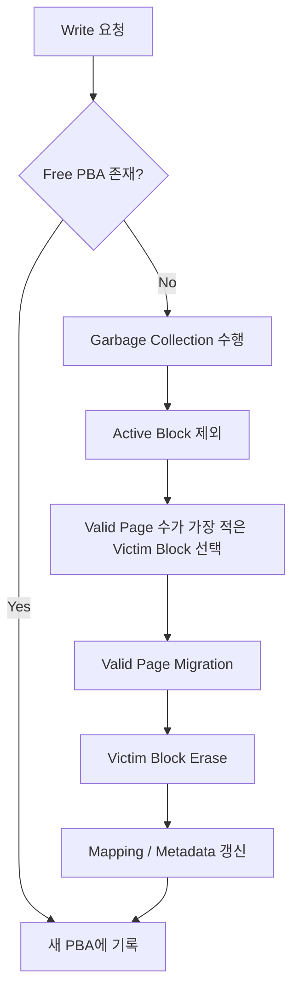

## layout: default  
title: 김태용 | System Programmer Portfolio

# 김태용 (Tae Yong Kim)

**System Software & Embedded Engineer**  
[Email](mailto:ktyong1225@inha.edu)  |  [GitHub](https://github.com/ttaeyong)

하드웨어 구조를 기준으로 성능 병목과 실행 흐름을 분석하는 시스템 프로그래머입니다.  
캐시 계층, 레지스터 제약, RTOS 태스크 구조를 고려해 성능 저하와 제어 흐름 문제를 해석하고, 저수준 소프트웨어 수준에서 해결하는 데 강점이 있습니다.

----------

## Core Strength

-   **Performance Analysis**: VTune 기반 병목 분석, cache hierarchy, SIMD, unrolling trade-off
    
-   **RTOS / Concurrency**: uC/OS-II 태스크 분리, Mailbox / Message Queue 기반 IPC 설계
    
-   **Embedded Control**: 인터럽트, ADC, 주기 태스크 스케줄링, 상태기계 기반 제어
    
-   **Storage Systems**: FTL mapping, Garbage Collection, stale page handling
    

----------

## 1. 하드웨어 아키텍처 기반 GEMM 최적화

**Naive 구현 대비 성능 15.2배 향상**

### Overview

행렬 곱셈의 성능을 높이기 위해, 단순 코드 수정이 아니라  **컴퓨터구조 관점에서 병목을 분석하고 최적화 방향을 재설계한 프로젝트**입니다. 초기에는 계산량 자체가 가장 큰 제약이라고 보았지만, VTune 분석과 실험 결과를 통해 실제 병목이  **메모리 접근 구조, 캐시 활용, 레지스터 제약**에 있다는 점을 확인했습니다.

### My Role

-   VTune 기반 병목 분석 수행
    
-   loop reordering, blocking, SIMD, unrolling 실험 설계 및 비교
    
-   성능 변화 시각화 및 하드웨어 관점 해석
    
-   최종 최적화 조합 설계
    

### Key Design Decisions

-   **Loop Reordering**:  `i-j-k`  순서를  `i-k-j`로 바꿔 공간 지역성 개선
    
-   **Blocking**: block size를 하드웨어 cache 크기를 기준으로 선택
    
-   **SIMD**: AVX-512 intrinsic 적용으로 벡터 연산 병렬화
    
-   **Loop Unrolling 조정**: 무작정 unroll 범위를 키우지 않고, 성능이 다시 꺾이는 지점에서 register pressure와 spilling 가능성을 함께 해석하며 범위 조정
    

### What I Verified

-   VTune에서  **Memory Bound**,  **L1 DTLB Overhead**,  **DRAM Bound**  비중을 확인해 병목의 출발점을 규정
    
-   thread 수 변경 실험으로 메모리 접근 경합 영향을 확인
    
-   loop reordering 이후 DRAM 접근 감소 경향 확인
    
-   block size는  **L1 data cache(48KB)**  기준으로 선택
    
-   unrolling 적용 시 line 단위 지표 비교를 통해 뒤쪽 배열 접근 구간의  **Clockticks 증가**와  **L1 Bound 상승**을 확인하고, register spilling 가능성을 해석
    

### Result

-   Naive 구현 대비  **15.2배 성능 향상**
    
-   성능 최적화는 기법을 많이 넣는 것이 아니라,  **하드웨어 구조에 맞는 수준을 찾는 과정**임을 학습
    

### Skills / Keywords

`C++`  `Intel VTune Profiler`  `AVX-512`  `Loop Reordering`  `Blocking`  `Loop Unrolling`  `Cache Locality`  `Register Pressure`

[VTune 병목 분석 보고서 확인 (PDF)](https://chatgpt.com/assets/pdf/Profiling_VTune_Examples.pdf)  
[SIMD 및 복합 최적화 보고서 확인 (PDF)](https://chatgpt.com/assets/pdf/Profiling_Matrix_Multiplication.pdf)

----------

## 2. RTOS 기반 센서 모니터링 및 경보 시스템

**ATmega128 + uC/OS-II**

### Overview

ATmega128과 uC/OS-II 기반으로 온도 센서와 조도 센서를 주기적으로 수집하고, 위험 온도 판단 및 LED/FND 출력을 수행하는 임베디드 시스템입니다. 단순 센서 읽기에 그치지 않고,  **태스크 책임 분리와 IPC 구조 설계**를 통해 RTOS 기반 데이터 흐름을 구성했습니다.

### My Role

-   전체 태스크 구조 설계
    
-   센서 입력 태스크 / 판별 태스크 / 출력 태스크 분리
    
-   Mailbox / Message Queue 기반 IPC 설계 및 구현
    
-   TWI(I2C), ADC, FND, LED 제어 로직 구현
    

### Task / IPC Design

-   **TemperatureTask**: LM75 온도 센서 데이터 수집
    
-   **ControlTempTask**: 경고 LED 제어 및 센서 데이터 전달
    
-   **ValuePostingTask**: 숫자 분해 및 디스플레이 데이터 생성
    
-   **DisplayTask**: FND 출력
    
-   **LdrTask**: 조도 기반 LED 제어
    

### Why It Matters

이 프로젝트의 핵심은  **RTOS primitive를 목적에 따라 다르게 사용했다는 점**입니다. 온도 데이터는 단일 최신값 전달이 중요해  **Mailbox**를 사용했고, 디스플레이용 숫자 데이터는 순차 출력이 필요해  **Message Queue**를 사용했습니다. 이를 통해 태스크별 책임을 분리하고, 동기화 구조를 직접 설계하는 경험을 쌓았습니다.

### What I Verified

-   센서 입력 변화에 따라 LED 경고 동작이 정상적으로 전환되는지 확인
    
-   태스크 간 데이터 전달 흐름이 Mailbox/Queue 설계 의도대로 동작하는지 확인
    
-   FND 표시 값이 센서 입력에 따라 정상 갱신되는지 검증
    

### Result

-   RTOS 환경에서  **태스크 분리, IPC 선택, 센서 입력 처리, 출력 동기화**를 통합적으로 설계
    
-   추상적인 운영체제 개념을 실제 임베디드 태스크 구조로 연결하는 경험 확보
    

### Skills / Keywords

`C`  `ATmega128`  `uC/OS-II`  `RTOS`  `Mailbox`  `Message Queue`  `TWI(I2C)`  `ADC`  `FND`

### Task / IPC Flow



<details> <summary><b>구현 개요 및 핵심 코드 보기</b></summary>
<div markdown="1">

### 구현 개요

1.  센서 입력 수집, 판단, 출력 태스크를 분리
    
2.  온도 데이터는 Mailbox로 최신값 전달
    
3.  FND 출력용 숫자 데이터는 Queue로 순차 전달
    
4.  RTOS 기반으로 센서 입력과 디스플레이 출력을 병행 처리
    

### 핵심 코드 예시

```c
void  TemperatureTask(void  *pdata)  
{  
  INT16U  temp;  
  while (1)  
 {  
  temp  =  ReadLm75Temperature();  
  OSMboxPost(TempMbox, (void  *)temp);  
  OSTimeDlyHMSM(0, 0, 0, 100);  
 }  
}

void  ValuePostingTask(void  *pdata)  
{  
  INT16U  temp;  
  INT8U  digits[4];  
  
  while (1)  
 {  
  temp  = (INT16U)OSMboxPend(TempMbox, 0, &err);  
  digits[0] =  temp  %  10;  
  digits[1] = (temp  /  10) %  10;  
  OSQPost(DisplayQ, &digits[0]);  
  OSQPost(DisplayQ, &digits[1]);  
 }  
}

```
</div> </details>

----------

## 3. 요구사항 기반 실시간 제어 시스템

**Infineon AURIX TC275**

### Overview

AURIX TC275 보드 기반으로 차량 속도 제어, 조도 감지, 과속 경고, 비상 모드 전환을 수행하는 실시간 제어 시스템입니다. 핵심은 기능 구현보다도  **요구사항을 주기 태스크로 분해하고, 인터럽트·ADC·상태기계를 결합해 실시간 흐름을 설계한 점**에 있습니다.

### My Role

-   요구사항을 기반으로 1ms / 10ms / 100ms / 1000ms task 구조 설계
    
-   STM compare interrupt 기반 스케줄 플래그 관리 로직 구현
    
-   ERU interrupt 기반 스위치 이벤트 처리
    
-   ADC 드라이버 직접 작성
    
-   FND 출력용 shift-out 로직 작성
    
-   상태기계 기반 주행 모드 전환 로직 구현
    

### Key Design Decisions

-   **비선점형 주기 태스크 구조**
    
    -   1ms: 속도 처리 및 FND 표시
        
    -   10ms: ADC 입력 취득
        
    -   100ms: 과속/조도/모드 표시 로직
        
    -   1000ms: 저주기 점검용 task
        
-   **상태기계 설계**
    
    -   NORMAL / CRUISE / EMERGENCY 모드 전환
        
-   **이벤트 처리**
    
    -   스위치 입력은 ERU interrupt로 감지하고, 실제 상태 전환은 main loop에서 수행
        
-   **Hardware-near control**
    
    -   FND 구동을 위해 clock/data/latch 시퀀스를 직접 제어하는 shift-out 로직 작성
        

### Why It Matters

이 프로젝트는 단순 MCU 실습이 아니라,  **요구사항 → 주기 태스크 → 인터럽트 이벤트 → 상태 전환 → 입출력 제어**로 이어지는 실시간 제어 구조를 직접 설계한 경험입니다. ADC 평균/필터링, 인터럽트 이벤트 처리, 상태기계 기반 모드 관리, 출력 제어를 하나의 흐름으로 묶었다는 점에서 실시간 임베디드 SW 역량을 보여줄 수 있습니다.

### What I Verified

-   일반/크루즈/비상 모드 전환이 요구사항대로 동작하는지 확인
    
-   ADC 입력에 따라 속도와 조도 출력이 정상 반영되는지 검증
    
-   과속 시 시각/청각 경고가 발생하는지 확인
    
-   인터럽트 발생 후 main loop에서 상태 전환이 정상 처리되는지 점검
    

### Skills / Keywords

`C`  `AURIX TC275`  `STM Interrupt`  `ERU Interrupt`  `ADC`  `State Machine`  `Real-time Scheduling`  `Driver Development`

### Periodic Task Design

| 주기 | Task | 주요 역할 |
|---|---|---|
| 1ms | AppTask1ms | 속도 처리, FND 표시 |
| 10ms | AppTask10ms | ADC 입력 취득 |
| 100ms | AppTask100ms | 과속 경고, 조도 확인, 현재 모드 표시 |
| 1000ms | AppTask1000ms | 저주기 상태 점검 |

### Input / Processing / Output Flow



<details> <summary><b>구현 개요 및 핵심 코드 보기</b></summary>
<div markdown="1">

### 구현 개요

1.  요구사항을 1/10/100/1000ms 태스크로 분해
    
2.  STM compare interrupt에서 scheduling flag set
    
3.  ERU interrupt로 스위치 이벤트 감지
    
4.  ADC 결과를 바탕으로 속도/조도 처리
    
5.  상태기계 기반 NORMAL / CRUISE / EMERGENCY 모드 전환
    
6.  FND와 LED/Buzzer 출력 반영
    

### 핵심 코드 예시

```c
void  AppScheduling(void)  
{  
  if(stSchedulingInfo.u8nuScheduling1msFlag  ==  1u)  
 {  
  stSchedulingInfo.u8nuScheduling1msFlag  =  0u;  
  AppTask1ms();  
 }  
  if(stSchedulingInfo.u8nuScheduling10msFlag  ==  1u)  
 {  
  stSchedulingInfo.u8nuScheduling10msFlag  =  0u;  
  AppTask10ms();  
 }  
  if(stSchedulingInfo.u8nuScheduling100msFlag  ==  1u)  
 {  
  stSchedulingInfo.u8nuScheduling100msFlag  =  0u;  
  AppTask100ms();  
 }  
  if(stSchedulingInfo.u8nuScheduling1000msFlag  ==  1u)  
 {  
  stSchedulingInfo.u8nuScheduling1000msFlag  =  0u;  
  AppTask1000ms();  
 }  
}

void  AppTaskHandleSpeed(void)  
{  
  switch(CUR_MODE)  
 {  
  case  MODE_NORMAL:  
  speed_current  = ((adc_resistor_result  *  200  +  2047) /  4095);  
  break;  
  case  MODE_CRUISE:  
  speed_current  =  70;  
  break;  
  case  MODE_EMERGENCY:  
  speed_current  =  0;  
  break;  
  default:  
  speed_current  =  0;  
 }  
}

void  send(uint8  X){  
  for (int  i  =  8; i  >  0; i--)  
 {  
  if (X  &  0x80) IfxPort_setPinHigh(DIO.port, DIO.pinIndex);  
  else  IfxPort_setPinLow(DIO.port, DIO.pinIndex);  
  
  X  <<=  1;  
  IfxPort_setPinLow(SCLK.port, SCLK.pinIndex);  
  IfxPort_setPinHigh(SCLK.port, SCLK.pinIndex);  
 }  
}

```
</div></details>

----------

## 4. NAND Flash Translation Layer (FTL) Emulator

**SSD Emulator**

### Overview

NAND Flash의  **Erase-before-write**  제약을 고려해, logical address를 physical page로 변환하고 garbage collection을 수행하는 FTL 에뮬레이터입니다. 저장장치 내부 로직을 추상적인 개념이 아니라  **mapping table, stale page, victim block, migration**  수준에서 코드로 모델링했습니다.

### My Role

-   page-level mapping 구조 설계
    
-   `LtoP`,  `PtoL`  매핑 테이블 구현
    
-   out-of-place update 처리
    
-   greedy victim block 기반 garbage collection 구현
    
-   block metadata(valid count, erase count) 관리
    

### Key Design Decisions

-   **Page-level Mapping**
    
    -   overwrite 시 기존 physical page를 invalid 처리
        
-   **Out-of-place Update**
    
    -   새 free page에 기록 후 logical mapping 갱신
        
-   **Greedy Garbage Collection**
    
    -   active block을 제외하고 valid page 수가 가장 적은 block을 victim으로 선택
        
-   **Migration**
    
    -   valid page만 새 위치로 복사 후 erase 수행
        

### Why It Matters

SSD 내부에서는 overwrite를 제자리에서 수행할 수 없기 때문에, 주소 변환과 garbage collection 정책이 성능과 write amplification에 직접 연결됩니다. 이 프로젝트를 통해 저장장치 내부에서  **왜 논리 주소와 물리 주소를 분리하는지**,  **왜 garbage collection이 필요한지**를 코드 수준에서 이해했습니다.

### What I Verified

-   logical write 반복 시 기존 physical page가 invalid 처리되는지 확인
    
-   free page 고갈 시 victim block 선택과 migration이 정상 수행되는지 검증
    
-   erase 이후 block metadata와 mapping table이 올바르게 갱신되는지 점검
    

### Result

-   page-level mapping, stale page 처리, victim selection, migration 흐름을 직접 구현
    
-   SSD 내부 동작을 시스템 소프트웨어 관점에서 해석하는 기초 확보
    

### Skills / Keywords

`C`  `FTL`  `Page Mapping`  `Out-of-place Update`  `Garbage Collection`  `Storage System`

### Garbage Collection Flow



### Address Mapping Structure

| 자료구조 | 역할 |
|---|---|
| `LtoP[]` | Logical Page → Physical Page 매핑 |
| `PtoL[]` | Physical Page → Logical Page 역매핑 |
| `blockMetaTable[]` | block별 valid count / erase count 관리 |
| `g_current_pba_index` | 다음 free page 탐색 시작점 |

<details> <summary><b>구현 개요 및 핵심 코드 보기</b></summary>
<div markdown="1">

### 구현 개요

1.  logical page와 physical page 간 mapping table 유지
    
2.  overwrite 시 기존 PBA를 invalid 처리
    
3.  free page 고갈 시 victim block 탐색
    
4.  valid page migration 후 block erase
    
5.  erase count, valid count 등 metadata 갱신
    

### 핵심 코드 예시

```c
int  ftl_internal_write(int  lba, uint32_t  data) {  
  int  pba  =  get_next_free_pba();  
  if (pba  ==  -1) return  -1;  
  
  nand_raw_write(pba, data);  
  
  int  old_pba  =  LtoP[lba];  
  if (old_pba  !=  -1) {  
  PtoL[old_pba] =  PBA_INVALID;  
  int  blk_idx  =  old_pba  /  PAGES_PER_BLOCK;  
  if (blockMetaTable[blk_idx].valid_count  >  0)  
  blockMetaTable[blk_idx].valid_count--;  
 }  
  
  LtoP[lba] =  pba;  
  PtoL[pba] =  lba;  
  
  int  new_blk_idx  =  pba  /  PAGES_PER_BLOCK;  
  blockMetaTable[new_blk_idx].valid_count++;  
  
  return  0;  
}

void  do_garbage_collection() {  
  int  victim_blk  =  -1;  
  int  min_valid  =  PAGES_PER_BLOCK  +  1;  
  int  active_blk  =  g_current_pba_index  /  PAGES_PER_BLOCK;  
  
  for (int  i  =  0; i  <  BLOCK_COUNT; i++) {  
  if (i  ==  active_blk) continue;  
  if (blockMetaTable[i].valid_count  <  min_valid) {  
  min_valid  =  blockMetaTable[i].valid_count;  
  victim_blk  =  i;  
 }  
 }  
  
  if (victim_blk  ==  -1) return;  
  
  int  startPba  =  victim_blk  *  PAGES_PER_BLOCK;  
  for (int  i  =  0; i  <  PAGES_PER_BLOCK; i++) {  
  int  old_pba  =  startPba  +  i;  
  int  lba  =  PtoL[old_pba];  
  
  if (lba  !=  -1  &&  LtoP[lba] ==  old_pba) {  
  uint32_t  data  =  nand_raw_read(old_pba);  
  if (ftl_internal_write(lba, data) ==  -1) {  
  printf("[CRITICAL] GC Failed: No Free Space for Migration\n");  
  return;  
 }  
 }  
 }  
  ssdEraseBlock(victim_blk);  
}

```
</div></details>

----------

## What I Learned Across Projects

네 프로젝트를 관통하며 공통적으로 배운 점은, 시스템 소프트웨어 문제는  **겉으로 보이는 기능보다 내부 구조와 자원 흐름에서 결정된다**는 점입니다.

-   GEMM 최적화에서는  **cache / register / SIMD**  수준에서 병목을 해석했습니다.
    
-   RTOS 프로젝트에서는  **task / IPC / sensor I/O**  수준에서 실행 흐름을 설계했습니다.
    
-   AURIX 프로젝트에서는  **interrupt / scheduling / state machine**  수준에서 실시간 제어 구조를 구성했습니다.
    
-   SSD Emulator에서는  **mapping / GC / migration**  수준에서 저장장치 내부 정책을 구현했습니다.
    

저는 하드웨어와 소프트웨어의 경계에서 발생하는 병목과 제약을 이해하고, 이를 저수준 소프트웨어 수준에서 해석하고 해결하는 엔지니어로 성장하고 있습니다.
