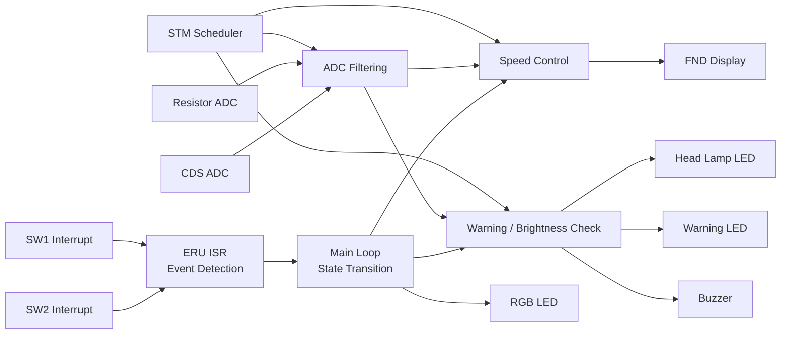
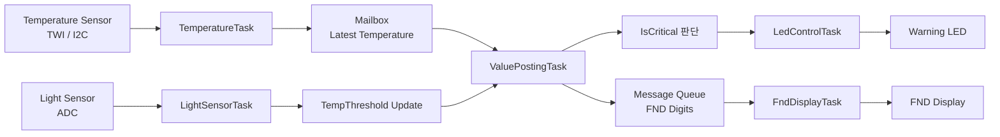
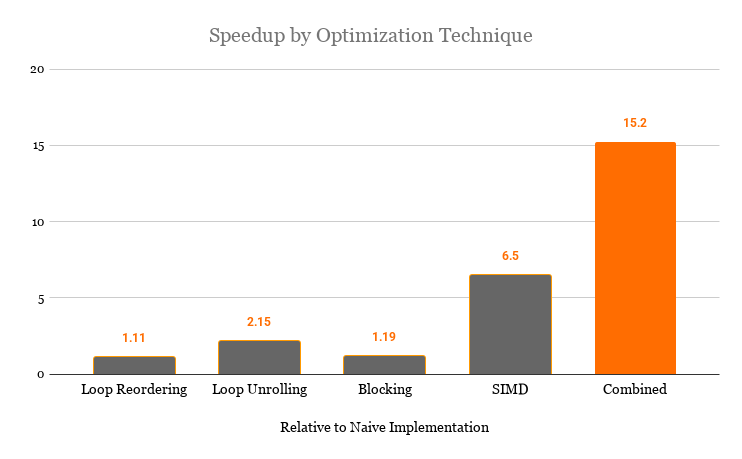
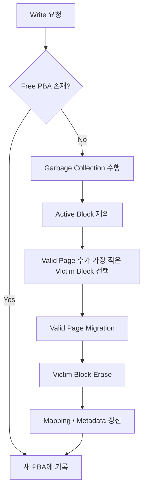

# 김태용 (Tae Yong Kim)

**Embedded & System Software Engineer**  
[Email](mailto:ktyong1225@inha.edu)  |  [GitHub](https://github.com/ttaeyong)

C/C++ 기반의 임베디드·시스템 소프트웨어 프로젝트를 수행하며, 실시간 제어와 시스템 내부 동작에 관심을 가져왔습니다.  
주기 태스크, 인터럽트, IPC, 상태기계 등을 직접 구현하면서 하드웨어 제약을 고려한 소프트웨어 구조를 경험했습니다.

---

## Core Strength

- **Real-time Control SW**: 주기 태스크 설계, 인터럽트 처리, 상태기계 기반 제어
- **Embedded SW Design**: 센서 입력, 제어 판단, 출력 반영 구조 설계
- **RTOS / Concurrency**: uC/OS-II 태스크 분리, Mailbox / Queue 기반 IPC 설계
- **SW Verification Mindset**: 입력-처리-출력 흐름 기준으로 동작 조건과 결과 점검
- **Low-level Implementation**: ADC, I2C(TWI), FND, LED, Flash 내부 로직 구현
- **System-level Analysis**: 성능 병목 분석, 자원 흐름 해석, 하드웨어 제약 기반 최적화

---

## 1. 요구사항 기반 실시간 제어 시스템

**Infineon AURIX TC275**

### Overview

AURIX TC275 보드 기반으로 차량 속도 제어, 조도 감지, 과속 경고, 비상 모드 전환을 수행한 실시간 제어 시스템입니다.  
핵심은 기능 구현 자체보다, **요구사항을 주기 태스크, 인터럽트 이벤트, 상태기계 기반 제어 로직으로 분해해 하나의 실행 흐름으로 연결한 점**에 있습니다.

### My Role

- 1ms / 10ms / 100ms / 1000ms 비선점형 주기 태스크 구조 설계
- STM compare interrupt 기반 스케줄 플래그 생성 로직 구현
- ERU interrupt 기반 스위치 이벤트 감지 및 main loop 상태 전이 구조 설계
- ADC 드라이버 직접 작성 및 센서 입력 평균/필터링 로직 구현
- NORMAL / CRUISE / EMERGENCY 상태기계 설계
- FND 출력용 shift-out 로직 및 LED / Buzzer 제어 구현

### Key Design Decisions

- **비선점형 주기 태스크 구조**
  - 1ms: 속도 계산 및 FND 표시
  - 10ms: ADC 입력 취득 및 필터링
  - 100ms: 과속 경고, 조도 판단, 현재 모드 표시
  - 1000ms: 저주기 상태 점검

- **이벤트 감지와 상태 전이 분리**
  - 스위치 입력은 ERU interrupt로 즉시 감지
  - ISR에서는 이벤트 발생만 기록하고, 실제 상태 전환은 main loop에서 처리
  - 인터럽트 처리 부담을 줄이고 제어 흐름을 단순화하도록 설계

- **상태기계 기반 제어**
  - NORMAL: 가변저항 ADC 입력에 비례한 속도 계산
  - CRUISE: 외부 입력과 무관하게 70km/h 유지
  - EMERGENCY: 즉시 0km/h로 감속 및 고정

- **센서값 안정화**
  - 가변저항 입력은 평균값 기반으로 처리
  - CDS 입력은 이동 평균 형태로 반영해 밝기 판단의 급격한 흔들림을 완화

### Verification

- SW1 / SW2 입력에 따라 일반, 크루즈, 비상 모드가 요구사항대로 전환되는지 확인
- 비상 입력이 일반/크루즈 모드보다 우선 반영되는지 점검
- ADC 입력 변화가 속도 계산 및 조도 판단 결과에 정상 반영되는지 확인
- 속도 120km/h 초과 시 LED 점멸과 Buzzer 경고가 발생하는지 검증
- 조도 임계치 미만에서 전조등 LED가 자동 점등되는지 확인
- 인터럽트에서 이벤트를 감지하고 main loop에서 상태 전환이 처리되는 구조가 의도대로 동작하는지 점검

### Result

- 요구사항을 **주기 태스크, 인터럽트 이벤트, 상태 전이, 출력 제어** 구조로 분해해 구현
- 실시간 제어 SW에서 입력 감지와 출력 반영 사이의 흐름을 직접 설계

### Job Relevance

요구사항을 주기 태스크, 이벤트 처리, 상태 전이 구조로 구체화하는 경험을 쌓았으며, 이는 실시간 제어가 중요한 임베디드 응용 SW나 장비 연동 SW를 이해하는 데 의미 있는 기반이 된다고 생각합니다.

### Skills / Keywords

`C` `AURIX TC275` `STM Interrupt` `ERU Interrupt` `ADC Driver` `State Machine` `Real-time Scheduling` `Embedded Control`

### Periodic Task Design

| 주기 | Task | 주요 역할 |
|---|---|---|
| 1ms | AppTask1ms | 속도 계산, FND 표시 |
| 10ms | AppTask10ms | ADC 입력 취득, 평균/필터링 |
| 100ms | AppTask100ms | 과속 경고, 조도 판단, 현재 모드 표시 |
| 1000ms | AppTask1000ms | 저주기 상태 점검 |

### Input / Processing / Output Flow



<details> <summary><b>구현 개요 및 핵심 코드 보기</b></summary> <div markdown="1">

### 구현 개요

1.  요구사항을 1/10/100/1000ms 태스크로 분해
    
2.  STM compare interrupt에서 scheduling flag 설정
    
3.  ERU interrupt로 스위치 이벤트 감지
    
4.  main loop에서 모드 전환 처리
    
5.  ADC 입력 평균/필터링 후 속도 및 조도 판단
    
6.  FND와 LED/Buzzer 출력 반영
    

### 핵심 코드 예시

```C
static boolean is_SW1_pushed(void)
{
    return sw1_isr_count != sw1_main_count;
}

static boolean is_SW2_pushed(void)
{
    return sw2_isr_count != sw2_main_count;
}

while (1)
{
    boolean event_sw1 = is_SW1_pushed();
    boolean event_sw2 = is_SW2_pushed();

    // ISR에서 감지한 이벤트를 main loop에서 소비
    if (event_sw1) sw1_main_count = sw1_isr_count;
    if (event_sw2) sw2_main_count = sw2_isr_count;

    // 상태 전이는 인터럽트 내부가 아닌 main loop에서 수행
    switch (CUR_MODE)
    {
        case MODE_NORMAL:
            if (event_sw2) CUR_MODE = MODE_EMERGENCY;
            else if (event_sw1) CUR_MODE = MODE_CRUISE;
            break;

        case MODE_CRUISE:
            if (event_sw2) CUR_MODE = MODE_EMERGENCY;
            else if (event_sw1) CUR_MODE = MODE_NORMAL;
            break;

        case MODE_EMERGENCY:
            if (event_sw2) CUR_MODE = MODE_NORMAL;
            break;
    }

    AppScheduling();
}

void AppTaskADC(void)
{
    static unsigned int adc_resistor_cnt = 0;
    static unsigned int adc_resistor_sum = 0;

    adc_resistor_input = Driver_Adc0_DataObtain();
    adc_cds_input = Driver_Adc1_DataObtain();
    Driver_Adc0_ConvStart();

    adc_resistor_cnt++;
    adc_resistor_sum += adc_resistor_input;

    // 가변저항 입력은 일정 구간 평균으로 안정화
    if (adc_resistor_cnt % 30 == 0)
    {
        adc_resistor_result = adc_resistor_sum / 30;
        adc_resistor_sum = 0;
    }

    // CDS 입력은 이동 평균 형태로 반영
    adc_cds_result = (adc_cds_result * 19 + adc_cds_input) / 20;
}

void AppTaskHandleSpeed(void)
{
    // 모드에 따라 속도 정책을 다르게 적용
    switch (CUR_MODE)
    {
        case MODE_NORMAL:
            speed_current = ((adc_resistor_result * 200 + 2047) / 4095);
            break;
        case MODE_CRUISE:
            speed_current = 70;
            break;
        case MODE_EMERGENCY:
            speed_current = 0;
            break;
        default:
            speed_current = 0;
            break;
    }
}
```

</div> </details>

----------

## 2. RTOS 기반 센서 모니터링 및 경보 시스템

**ATmega128 + uC/OS-II**

### Overview

ATmega128과 uC/OS-II 기반으로 온도 센서와 조도 센서를 주기적으로 수집하고, 환경 조건에 따라 임계 온도를 조정하며, 경고 LED와 FND 출력을 수행한 프로젝트입니다.  
핵심은 기능 구현 자체보다, **입력 수집, 상태 판단, 디스플레이, 경고 출력을 태스크 단위로 분리하고 목적에 맞는 IPC로 연결한 점**에 있습니다.

### My Role

- uC/OS-II 기반 5개 태스크 구조 설계 및 우선순위 배치
- TWI(I2C) 기반 온도 센서 입력 처리 및 ADC 기반 조도 센서 입력 처리 구현
- Mailbox / Message Queue 기반 IPC 구조 설계
- 조도 조건에 따라 온도 임계값을 조정하는 제어 로직 구현
- 임계 상태(`IsCritical`) 기반 LED 경고 로직 구현
- FND 표시 데이터 생성 및 출력 태스크 구현

### Key Design Decisions

- **태스크 책임 분리**
  - TemperatureTask: 온도 센서 읽기
  - ValuePostingTask: 온도값 해석, 임계 상태 판단, FND 데이터 생성
  - FndDisplayTask: FND 출력
  - LightSensorTask: 조도 측정 및 온도 임계값 조정
  - LedControlTask: 위험 상태에 따른 LED 경고 출력

- **목적에 따른 IPC 분리**
  - 온도값은 가장 최신 데이터가 중요하므로 **Mailbox**로 전달
  - FND 출력 데이터는 순차 소비가 필요하므로 **Message Queue**로 전달

- **환경 조건 기반 제어 정책**
  - 조도 센서 값에 따라 `TempThreshold`를 다르게 설정
  - 주변이 어두울 때와 밝을 때의 기준을 달리해 경고 조건을 조정

- **상태 기반 출력**
  - `IsCritical` 상태를 기준으로 LED 점멸 여부를 분리
  - 센서 입력과 표시/경고 출력을 독립 태스크에서 병행 수행하도록 구성

### Verification

- 온도 센서 값이 Mailbox를 통해 정상적으로 전달되는지 확인
- 조도 조건 변화에 따라 `TempThreshold`가 의도대로 변경되는지 점검
- 온도값이 임계치를 초과할 때 `IsCritical` 상태가 정상 반영되는지 확인
- Message Queue를 통해 FND 표시용 숫자 데이터가 순차적으로 전달되는지 검증
- 위험 상태에서 LED가 주기적으로 점멸하고, 정상 상태에서는 꺼진 상태를 유지하는지 확인
- 센서 입력, 판단, 표시, 경고 출력이 각 태스크에서 병행 실행되는 구조가 의도대로 동작하는지 점검

### Result

- RTOS 환경에서 **센서 입력, 상태 판단, 디스플레이, 경고 출력**을 태스크 단위로 분리해 구현
- IPC 선택에 따라 데이터 전달 방식이 달라진다는 점을 실제 시스템 구조로 연결
- 입력 조건 변화에 따라 임계값과 출력 동작이 달라지는 제어 흐름을 직접 설계

### Job Relevance

태스크 분리, IPC 설계, 상태 기반 출력 제어를 구현하며 실시간 임베디드 SW의 실행 구조를 구체적으로 경험했습니다.  
향후 제어 흐름과 데이터 전달 구조가 중요한 기반 SW나 임베디드 응용 SW를 이해하는 데 확장 가능한 기반이 될 것이라 생각합니다.

### Skills / Keywords

`C` `ATmega128` `uC/OS-II` `RTOS` `Mailbox` `Message Queue` `TWI(I2C)` `ADC` `FND` `Embedded Control`

### Task / IPC Design

| Task | 주요 역할 |
|---|---|
| TemperatureTask | TWI 기반 온도 센서 값 수집 |
| ValuePostingTask | 온도값 해석, 임계 상태 판단, FND 데이터 생성 |
| FndDisplayTask | Queue 기반 FND 출력 |
| LightSensorTask | ADC 기반 조도 측정, 임계 온도 조정 |
| LedControlTask | 위험 상태에 따른 LED 점멸 제어 |

### Input / Processing / Output Flow



<details> <summary><b>구현 개요 및 핵심 코드 보기</b></summary> <div markdown="1">

### 구현 개요

1. uC/OS-II 기반으로 온도 수집, 값 해석, 디스플레이, 조도 판단, LED 제어 태스크를 분리
2. 온도 데이터는 Mailbox로 최신값 전달
3. FND 표시 데이터는 Queue로 순차 전달
4. 조도 값에 따라 임계 온도를 조정
5. 임계 상태를 별도 상태값으로 관리하고 LED 출력에 반영

### 핵심 코드 예시

```C
void TemperatureTask(void *data)
{
    data = data;
    USHORT value;
    InitI2C();

    write_twi_1byte_nopreset(ATS75_CONFIG_REG, 0x00);
    write_twi_0byte_nopreset(ATS75_TEMP_REG);

    while (1)
    {
        value = ReadTemperature();
        OSMboxPost(Mbox, (void *)value);
        OSTimeDlyHMSM(0, 0, 1, 0);
    }
}

void ValuePostingTask(void *data)
{
    INT8U err;
    data = data;
    UCHAR value_int, value_deci;
    static UCHAR num[4];
    USHORT now_value;

    while (1)
    {
        now_value = (USHORT)(INT32U)OSMboxPend(Mbox, 0, &err);

        if ((now_value & 0x8000) != 0x8000)
        {
            num[3] = 11;
        }
        else
        {
            num[3] = 10;
            now_value = (~now_value) + 1;
        }

        value_int = (char)((now_value & 0x7f00) >> 8);
        value_deci = (char)(now_value & 0x00ff);

        // 현재 온도가 임계치를 넘으면 위험 상태로 반영
        if (value_int >= TempThreshold) IsCritical = 1;
        else IsCritical = 0;

        num[2] = (value_int / 10) % 10;
        num[1] = value_int % 10;
        num[0] = ((value_deci & 0x80) == 0x80) * 5;

        OSQPost(MsgQueue, (void *)&num[0]);
        OSQPost(MsgQueue, (void *)&num[1]);
        OSQPost(MsgQueue, (void *)&num[2]);
        OSQPost(MsgQueue, (void *)&num[3]);

        OSTimeDlyHMSM(0, 0, 1, 0);
    }
}

void LightSensorTask(void *data)
{
    unsigned short adc_value;
    data = data;

    while (1)
    {
        adc_value = read_adc();

        // 주변 밝기에 따라 온도 임계값을 동적으로 조정
        if (adc_value < CDS_VALUE) TempThreshold = 15;
        else TempThreshold = 28;

        OSTimeDlyHMSM(0, 0, 1, 0);
    }
}

void LedControlTask(void *data)
{
    data = data;
    DDRA = 0xFF;
    PORTA = 0x00;

    while (1)
    {
        if (IsCritical == 1)
        {
            PORTA = ~PORTA;
            OSTimeDlyHMSM(0, 0, 0, 500);
        }
        else
        {
            PORTA = 0x00;
            OSTimeDlyHMSM(0, 0, 0, 200);
        }
    }
}
```

</div> </details>

----------

## 3. 하드웨어 아키텍처 기반 GEMM 최적화

**Naive 구현 대비 성능 15.2배 향상**

### Overview

행렬 곱셈 성능을 높이기 위해 VTune으로 병목을 분석하고, 메모리 접근 구조와 레지스터 제약을 기준으로 최적화를 설계한 프로젝트입니다.  
단순히 기법을 추가하는 방식이 아니라,  **캐시 지역성·DRAM 접근·register pressure를 함께 고려해 최적 조합을 찾는 과정**에 집중했습니다.

### My Role

-   VTune 기반 병목 분석
    
-   loop reordering, blocking, SIMD, unrolling 실험 설계 및 비교
    
-   성능 변화 해석 및 최종 최적화 조합 설계
    

### Key Design Decisions

-   **Loop Reordering**:  `i-j-k`  →  `i-k-j`로 변경해 공간 지역성 개선
    
-   **Blocking**: cache 크기를 기준으로 block size 설정
    
-   **SIMD**: AVX-512 intrinsic 적용
    
-   **Unrolling 조정**: 과도한 unrolling이 register pressure와 spilling으로 이어질 수 있음을 고려해 범위 조정
    

### Verification

-   VTune에서  `Memory Bound`,  `L1 DTLB Overhead`,  `DRAM Bound`  비중 확인
    
-   thread 수 변화 실험으로 메모리 접근 경합 영향 점검
    
-   loop reordering 이후 DRAM 접근 감소 경향 확인
    
-   unrolling 적용 시 일부 구간의  `Clockticks`  증가와  `L1 Bound`  상승을 분석
    

### Result

-   Naive 구현 대비  **15.2배 성능 향상**
    
-   성능 최적화는 기법 적용만 중요한 것이 아닌,  **하드웨어 구조에 대한 이해가 필요한 과정**임을 학습
    

### Job Relevance

자원 제약과 병목을 분석한 경험은 향후 실시간 시스템의 응답성과 처리 효율을 이해하는 데 도움이 될 수 있다고 생각합니다.

### Skills / Keywords

`C++`  `Intel VTune Profiler`  `AVX-512`  `Loop Reordering`  `Blocking`  `Loop Unrolling`  `Cache Locality`  `Register Spilling`

### Optimization Pipeline

| Version | 핵심 아이디어 | 의미 |
| --- | --- | --- |
| Naive | 기본 구현 | baseline |
| Loop Reordering | `i-j-k → i-k-j` | 공간 지역성 개선 |
| Blocking | cache 크기 고려 | 메모리 병목 완화 |
| SIMD | AVX-512 적용 | 벡터 연산 병렬화 |
| Combined | 기법 결합 | 최종 15.2배 향상 |

### Performance Comparison



_Naive 구현 대비 성능 향상 배수입니다. 단일 기법만으로는 개선 폭이 제한적이었고,  
캐시 구조와 레지스터 제약을 함께 고려한 복합 최적화에서 가장 큰 성능 향상을 얻었습니다._

[VTune 병목 분석 보고서 확인 (PDF)](./assets/pdf/Profiling_VTune_Examples.pdf)  
[SIMD 및 복합 최적화 보고서 확인 (PDF)](./assets/pdf/Profiling_Matrix_Multiplication.pdf)

----------

## 4. NAND Flash Translation Layer (FTL) Emulator

**SSD Emulator**

### Overview

NAND Flash의 erase-before-write 제약을 고려해, logical address를 physical page로 변환하고 garbage collection을 수행하는 FTL 에뮬레이터입니다.  
mapping table, stale page, victim block, migration 흐름을 코드 수준에서 구현하며 저장장치 내부 동작을 분석했습니다.

### My Role

-   page-level mapping 구조 설계
    
-   `LtoP`,  `PtoL`  매핑 테이블 구현
    
-   out-of-place update 처리
    
-   greedy victim block 기반 garbage collection 구현
    
-   block metadata(valid count, erase count) 관리
    

### Key Design Decisions

-   **Page-level Mapping**
    
    -   overwrite 시 기존 physical page invalid 처리
        
-   **Out-of-place Update**
    
    -   새 free page에 기록 후 logical mapping 갱신
        
-   **Greedy Garbage Collection**
    
    -   active block을 제외하고 valid page 수가 가장 적은 block을 victim으로 선택
        
-   **Migration**
    
    -   valid page만 새 위치로 복사 후 erase 수행
        

### Verification

- 반복 write 및 overwrite 시나리오에서 기존 physical page가 invalid 처리되는지 확인: 로그 출력으로 mapping 변화 추적
 
- free page 고갈 조건에서 victim block 선택과 valid page migration이 정상 수행되는지 점검: GC 전후 block 상태와 이동 결과 확인

- erase 이후 metadata와 mapping table이 올바르게 갱신되는지 검증: LtoP / PtoL / block metadata 출력값 비교


### Result

- page-level mapping, stale page 처리, victim selection, migration 흐름을 구현하고 총 64개 block 환경에서 반복 write / GC 시나리오를 실행하며 동작을 확인
  
-  내부 상태와 자원 관리를 요구하는 시스템 소프트웨어 구조를 코드와 로그 기반으로 점검하며 이해


### Job Relevance

복잡한 내부 상태를 일관되게 관리한 경험은 향후 상태 기반 로직 설계와 검증이 중요한 시스템 소프트웨어를 이해하는 데 의미 있는 기반이 된다고 생각합니다.

### Skills / Keywords

`C`  `FTL`  `Page Mapping`  `Out-of-place Update`  `Garbage Collection`  `Storage System`

### Garbage Collection Flow



----------

## What I Learned Across Projects

프로젝트를 수행하며 공통적으로 배운 점은, 시스템 소프트웨어 문제는 겉으로 보이는 기능보다 **내부 구조, 자원 흐름, 상태 관리 방식**에서 결정된다는 점입니다.

- 실시간 제어에서는 **주기 태스크, 인터럽트, 상태 전이**가 중요했습니다.
- RTOS 환경에서는 **태스크 책임 분리와 IPC 구조**가 핵심이었습니다.
- 성능 최적화에서는 **캐시, 메모리 접근, 레지스터 제약**이 병목을 결정했습니다.
- 저장장치 시스템에서는 **매핑, GC, 내부 상태 일관성**이 핵심이었습니다.

앞으로도 하드웨어와 소프트웨어 사이의 제약을 이해하고, 이를 제어·연동·검증 가능한 소프트웨어 구조로 구현하는 엔지니어로 성장하고자 합니다.

<script src="https://cdn.jsdelivr.net/npm/mermaid/dist/mermaid.min.js"></script> <script> window.onload = function() { mermaid.initialize({ startOnLoad: true }); mermaid.init(undefined, document.querySelectorAll('.language-mermaid')); }; </script>
