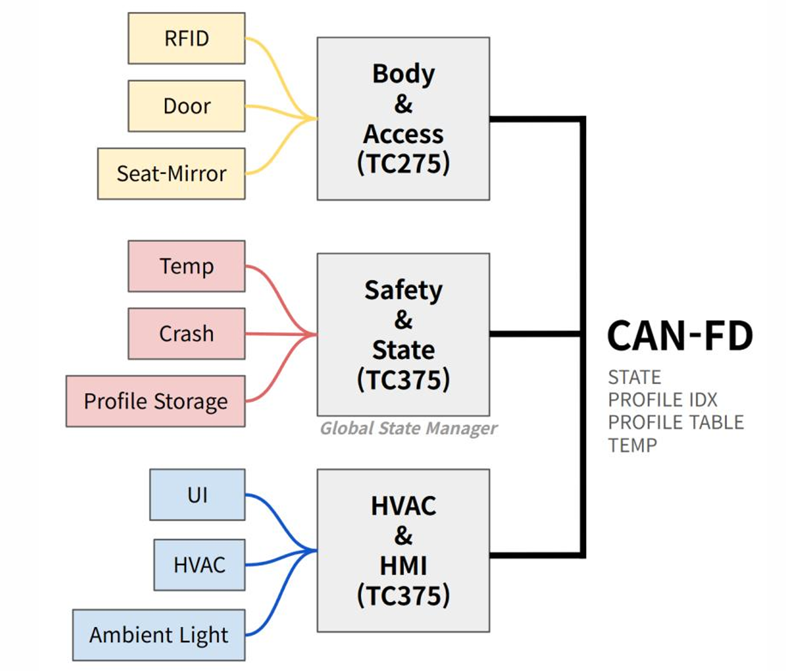
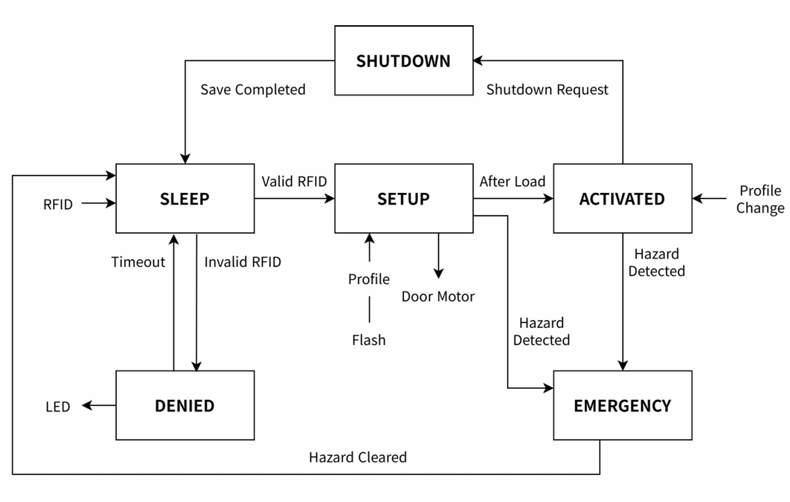
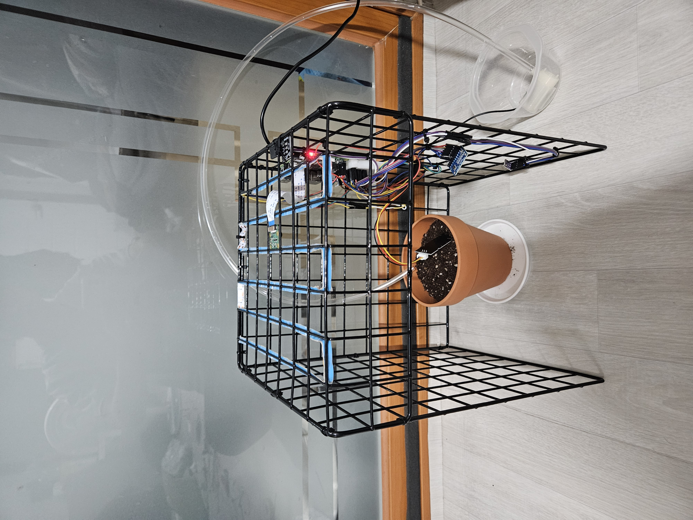
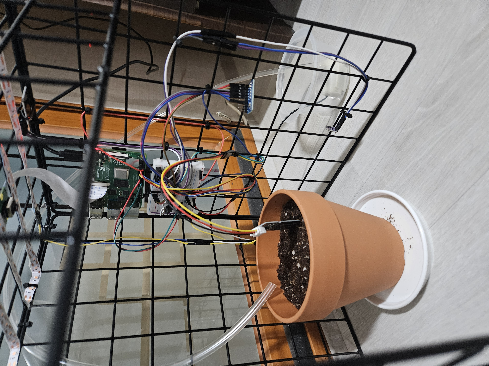
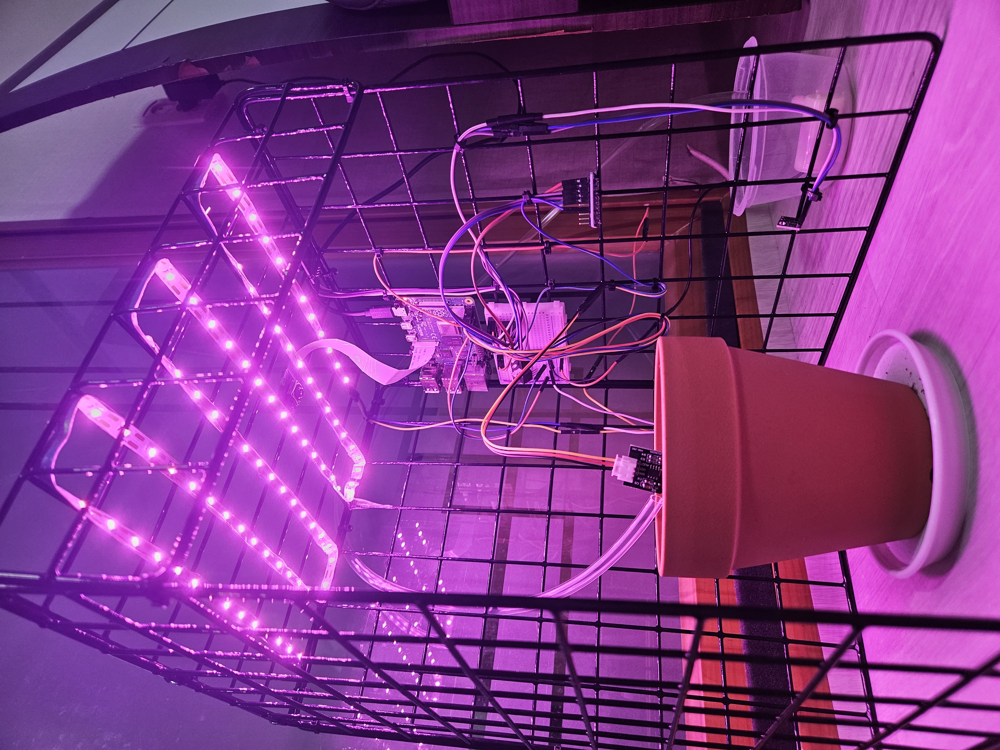
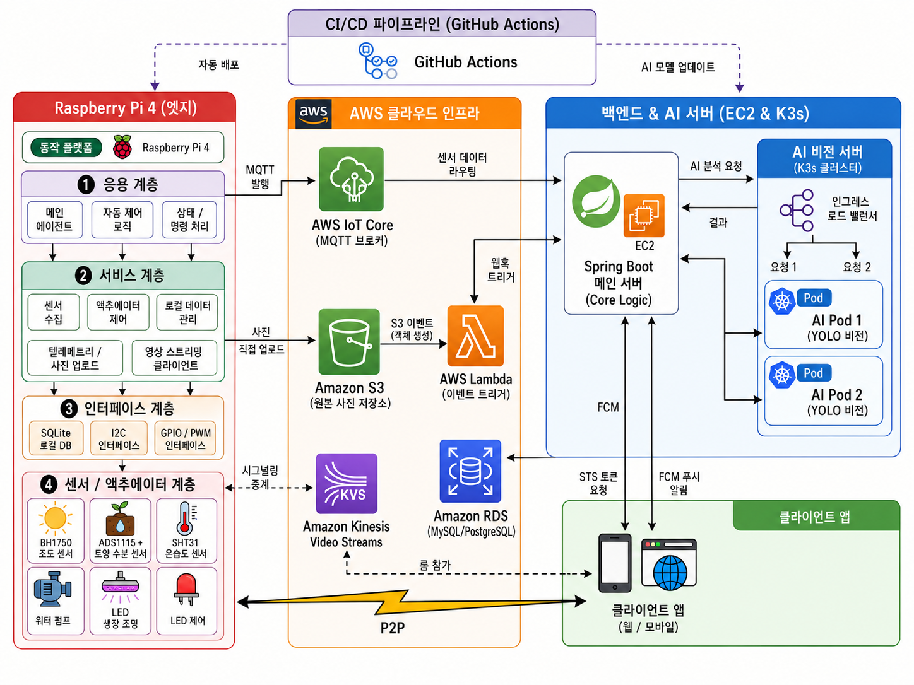
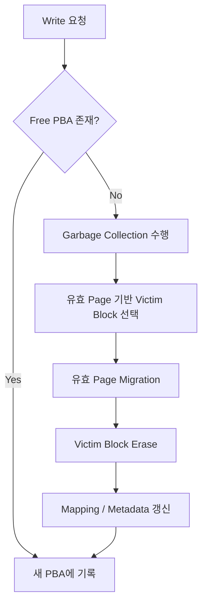
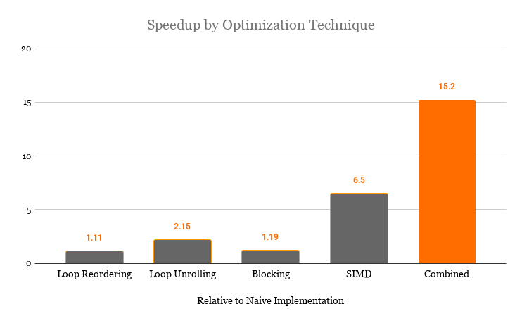

# 김태용 (Tae Yong Kim)

**Embedded & System Software Engineer**  
[Email](mailto:ktyong1225@inha.edu) | [GitHub](https://github.com/ttaeyong)

C/C++ 기반의 임베디드·시스템 소프트웨어 프로젝트를 수행하며, 실시간 제어와 시스템 내부 동작에 관심을 가져왔습니다.  
주기 태스크, 인터럽트, 비휘발성 메모리, Flash update, 저장장치 내부 구조, 성능 병목 분석을 경험하며 하드웨어 제약을 고려한 소프트웨어 구조를 구현해왔습니다.

---

## Core Strength

- **Real-time Control SW**: 주기 태스크 설계, 인터럽트 처리, 상태기계 기반 제어
- **Embedded System Integration**: 센서 입력, 제어 판단, 출력 반영, 장치 상태 관리 구조 설계
- **Flash / Reprogramming**: PFlash write, CRC 검증, UCB_SWAP activation, rollback 흐름 구현
- **Memory & Storage System**: SSD FTL, LBA-PBA mapping, metadata 관리, Garbage Collection 구현
- **System-level Analysis**: 성능 병목 분석, 메모리 계층 구조 해석, 하드웨어 제약 기반 최적화
- **SW Verification Mindset**: 입력-처리-출력 흐름과 내부 상태 기준의 동작 검증

---

## 1. 차량 ECU SW 및 FOTA Reprogramming

**Infineon AURIX TC275 / TC375**

### Overview

AURIX TC275/TC375 기반 프로젝트를 통해 차량 ECU의 설정값 저장·복원, 주기 태스크 기반 실행 구조, Flash update 및 rollback 흐름을 구현했습니다.  
단순 기능 구현보다 **ECU 내부 상태 관리, 비휘발성 저장, Flash 메모리 배치, 업데이트 안정성 검증**에 집중했습니다.

### System Architecture

  

    

      
    

    
<em>다중 ECU 기반 차량 설정 개인화 시스템 구성도</em>

  

  

    

      
    

    
<em>ECU 기능 분담, 상태 전이, DFlash 프로필 저장 구조</em>

  

### My Role

- AURIX TC275 기반 프로젝트에서 주기 태스크와 이벤트 처리 흐름 구성
- Access & Body ECU 기능 구현
- DFlash 기반 사용자 프로필 저장·복원 기능 구현
- UDS 기반 업데이트 흐름 통합
- 담당 ECU reprogramming 기능 구현
- inactive PFlash write, CRC32 검증, UCB_SWAP activation 및 rollback 흐름 구현
- map file 및 linker script 기반 Flash 메모리 배치 분석
- 메모리 구조 분석 및 linker script 조정을 통한 업데이트 시간 단축

### Project 1. CAN-FD 기반 다중 ECU 차량 설정 개인화 시스템

차량 설정값을 ECU 내부 상태와 연계하고, 재부팅 이후에도 설정이 유지되도록 DFlash 기반 저장·복원 구조를 구현했습니다.

#### Key Implementation

- AURIX TC275 기반 프로젝트에서 주기 태스크와 이벤트 처리 흐름 구성
- Access & Body ECU 기능 구현
- 통신으로 수신한 사용자 설정값을 ECU 내부 상태와 연계
- DFlash 기반 사용자 프로필 저장·복원 구현
- 재부팅 후에도 차량 설정이 유지되도록 비휘발성 저장 구조와 상태 복원 흐름 검증

### Project 2. AURIX TC375 기반 FOTA Reprogramming

FOTA 프로젝트에서는 담당 ECU의 reprogramming과 rollback 흐름을 구현하고, Flash 메모리 구조와 부팅 흐름을 분석했습니다.

#### Key Implementation

- UDS 기반 업데이트 흐름 통합 참여 및 담당 ECU reprogramming 기능 구현
- inactive PFlash write, CRC32 검증, UCB_SWAP activation 및 rollback 흐름 구현
- 업데이트 대상 Flash 영역 산정 및 write 범위 조정
- 메모리 구조 분석 및 linker script 조정을 통해 업데이트 시간을 약 30배 단축

#### Troubleshooting

- 초기 reprogramming 과정에서 Flash 메모리 영역 침범으로 부팅 중 trap이 발생했습니다.
- 업데이트 이미지의 write 범위와 Flash 배치를 확인하고, 침범 가능성이 있는 영역을 분리해 정상 업데이트 및 부팅 흐름을 검증했습니다.

#### Improvement

- map file과 linker script를 기준으로 실제 변경이 필요한 Flash section을 확인했습니다.
- 불필요한 영역까지 전송·write하지 않도록 업데이트 대상 범위를 조정해 업데이트 시간을 약 30배 단축했습니다.

### Verification

- 사용자 설정값이 DFlash에 저장되고 재부팅 후 정상 복원되는지 확인
- 업데이트 이미지 write 이후 CRC32 검증 결과 확인
- UCB_SWAP activation 이후 alternate image로 정상 부팅되는지 확인
- rollback 수행 시 이전 영역으로 복구 가능한지 확인
- 업데이트 대상 영역 축소 이후 전송 시간과 부팅 결과 비교

### Job Relevance

실시간 제어, 비휘발성 저장, Flash update, rollback, 장애 원인 분석을 수행하며 장치 단위 기능 구현을 시스템 안정성 관점으로 확장해 경험했습니다.  
이는 장비 제어 SW, 자동화 시스템 운영, 업데이트 안정성, 현장 시스템 문제 분석이 중요한 직무에 활용 가능한 기반이라고 생각합니다.

### Skills / Keywords

`C` `AURIX TC275` `AURIX TC375` `CAN-FD` `DFlash` `PFlash` `CRC32` `UCB_SWAP` `Rollback` `FOTA` `Linker Script` `Trap Analysis`

---

## 2. 원격 스마트팜 시스템

**Raspberry Pi 4 / AWS IoT / MQTT / Kinesis Video Streams**

### Overview

라즈베리파이4 기반으로 센서 수집, 액추에이터 제어, MQTT 기반 원격 명령, 카메라 이미지 업로드 및 스트리밍을 수행하는 원격 스마트팜 시스템을 구현했습니다.  
캡스톤디자인 최종 발표 및 전시를 통해 장려상을 수상했습니다.

### Final Output

  

    
    
<em>원격 스마트팜 최종 산출물</em>

  

  

    
    
<em>센서·액추에이터 통합 구성</em>

  

  
  
<em>MQTT, GPIO/PWM 기반 LED grow light 제어 확인</em>

### System Architecture

  

<em>Edge Device, AWS IoT, S3, Kinesis Video Streams, Backend Server, AI Vision Server, Client App을 연동한 원격 스마트팜 시스템 아키텍처</em>

### My Role

- 온습도·조도·토양수분 센서 수집 구조 구현
- I2C 기반 센서 인터페이스 통합
- 워터펌프 및 LED grow light GPIO/PWM 제어 로직 구현
- 센서 수집, 명령 처리, 장치 상태 관리가 함께 동작하는 실행 구조 구성
- AWS IoT 인증서 기반 MQTT telemetry publish 기능 구현
- MQTT command 구독 기반 물주기 및 LED 밝기 제어 기능 구현
- PiCamera3 촬영 이미지의 presigned URL 기반 업로드 기능 구현
- AWS Kinesis Video Streams 기반 카메라 스트리밍 기능 구현

### Key Design Decisions

- **센서 수집과 장치 제어 분리**
  - 온습도, 조도, 토양수분 센서 값을 주기적으로 수집
  - 펌프와 LED는 서버 명령에 따라 독립적으로 제어

- **MQTT 기반 원격 제어**
  - telemetry topic으로 센서 데이터를 publish
  - command topic을 구독해 서버 명령 기반으로 물주기와 LED 밝기 제어

- **카메라 데이터 연동**
  - PiCamera3 촬영 이미지를 presigned URL 기반으로 업로드
  - 실시간 확인이 필요한 경우 Kinesis Video Streams 기반 스트리밍 구조 활용

- **장치 상태 관리**
  - 센서 수집, 제어 명령 처리, 액추에이터 상태를 함께 관리
  - 원격 명령이 실제 장치 동작으로 이어지는 흐름을 통합

### Verification

- 온습도·조도·토양수분 센서 데이터가 정상 수집되는지 확인
- MQTT telemetry publish와 서버 수신 여부 확인
- MQTT command 수신 후 펌프 및 LED 제어가 정상 수행되는지 확인
- PWM 기반 LED 밝기 제어 동작 확인
- 촬영 이미지가 presigned URL을 통해 정상 업로드되는지 확인
- Kinesis Video Streams 기반 카메라 스트리밍 동작 확인

### Result

- 센서 수집, 원격 명령, 액추에이터 제어, 이미지 업로드, 스트리밍이 연결된 원격 스마트팜 시스템 구현
- 캡스톤디자인 최종 발표 및 전시를 통해 장려상 수상
- 물리 장치와 서버/클라우드가 연동되는 시스템 구조를 직접 구현

### Job Relevance

센서 데이터 수집, 장치 상태 관리, 원격 명령 처리, 서버 연동을 구현하며 물리 시스템과 IT 시스템이 연결되는 구조를 경험했습니다.  
이는 현장 장비의 상태를 수집하고, 원격에서 제어하며, 데이터 기반으로 운영하는 시스템을 이해하는 데 의미 있는 기반이 된다고 생각합니다.

### Skills / Keywords

`Python` `Raspberry Pi 4` `GPIO` `PWM` `I2C` `MQTT` `AWS IoT` `Kinesis Video Streams` `PiCamera3` `Presigned URL` `Sensor Integration`

---

## 3. NAND Flash Translation Layer Emulator

**SSD Emulator**

### Overview

NAND Flash의 erase-before-write 제약을 고려해 logical address를 physical page로 변환하고, Garbage Collection을 수행하는 SSD Emulator입니다.  
LBA-PBA mapping, metadata 관리, valid/invalid page 처리, victim block 선정, migration 흐름을 구현하며 저장장치 내부 동작을 분석했습니다.

### My Role

- C 기반 SSD Emulator 메인 로직 구현
- NAND read/write, LBA-PBA 매핑, block 단위 erase 구조 구현
- LtoP/PtoL table 기반 page mapping FTL 구현
- write 요청에 따른 신규 PBA 할당, 기존 PBA invalid 처리, mapping table 갱신 흐름 구현
- block/page metadata 관리 로직 구현
- valid page 수 기반 victim block 선정 및 Garbage Collection 로직 구현

### Key Design Decisions

- **Page-level Mapping**
  - logical page와 physical page를 LtoP/PtoL table로 관리
  - overwrite 발생 시 기존 physical page를 invalid 처리

- **Out-of-place Update**
  - NAND Flash의 erase-before-write 제약을 고려해 새 free page에 기록 후 mapping table 갱신

- **Greedy Garbage Collection**
  - free page 부족 시 valid page 수가 적은 block을 victim으로 선정
  - valid page migration 이후 victim block erase 수행

- **Metadata Management**
  - block, page, valid/invalid 상태를 metadata로 관리
  - over-provisioning과 invalid page 증가에 따른 GC 수행 조건 확인

### Verification

- 반복 write 및 overwrite 시 기존 physical page가 invalid 처리되는지 로그로 확인
- LtoP/PtoL mapping table이 요청 처리에 따라 정상 갱신되는지 확인
- free page 부족 조건에서 victim block 선정과 valid page migration 동작 확인
- block erase 이후 metadata와 mapping table이 일관되게 갱신되는지 점검

### Result

- NAND read/write, LBA-PBA mapping, block erase, metadata 관리, Garbage Collection을 포함한 SSD 내부 동작 구조 구현
- over-provisioning과 invalid page 증가가 GC 비용 및 유효 페이지 이동량에 미치는 영향 확인
- 저장장치의 성능이 외부 API뿐 아니라 내부 상태 관리와 정책에 의해 달라진다는 점을 이해

### Job Relevance

SSD 내부의 주소 변환, metadata 관리, Garbage Collection을 직접 구현하며 메모리 제품의 내부 동작을 시스템 소프트웨어 관점에서 이해했습니다.  
이는 메모리 제품 검증, 성능 분석, 내부 상태 기반 문제 원인 분석에 필요한 기반 경험이라고 생각합니다.

### Skills / Keywords

`C` `SSD Emulator` `FTL` `LBA-PBA Mapping` `Page Mapping` `Out-of-place Update` `Garbage Collection` `Metadata Management` `Storage System`

### Garbage Collection Flow

```mermaid
flowchart TD
    A[Write 요청] --> B{Free PBA 존재?}
    B -- Yes --> C[새 PBA에 기록]
    B -- No --> D[Garbage Collection 수행]

    D --> E[유효 Page 기반 Victim Block 선택]
    E --> F[유효 Page Migration]
    F --> G[Victim Block Erase]
    G --> H[Mapping / Metadata 갱신]
    H --> C
```

---

## 4. 하드웨어 아키텍처 기반 GEMM 최적화

**Naive 구현 대비 성능 15.2배 향상**

### Overview

행렬 곱셈 성능을 높이기 위해 VTune으로 병목을 분석하고, 메모리 접근 구조와 레지스터 제약을 기준으로 최적화를 설계한 프로젝트입니다.  
단순히 기법을 추가하는 방식이 아니라, 캐시 지역성·DRAM 접근·register pressure를 함께 고려해 최적 조합을 찾는 과정에 집중했습니다.

### My Role

- VTune 기반 병목 분석
- loop reordering, blocking, SIMD, unrolling 실험 설계 및 비교
- 성능 변화 해석 및 최종 최적화 조합 설계
- 최적화 결과 정량 비교 및 기술보고서 작성

### Key Design Decisions

- **Loop Reordering**: `i-j-k` → `i-k-j`로 변경해 공간 지역성 개선
- **Blocking**: cache 크기를 기준으로 block size 설정
- **SIMD**: AVX-512 intrinsic 적용
- **Unrolling 조정**: 과도한 unrolling이 register pressure와 spilling으로 이어질 수 있음을 고려해 범위 조정

### Verification

- VTune에서 `Memory Bound`, `L1 DTLB Overhead`, `DRAM Bound` 비중 확인
- thread 수 변화 실험으로 메모리 접근 경합 영향 점검
- loop reordering 이후 DRAM 접근 감소 경향 확인
- unrolling 적용 시 일부 구간의 `Clockticks` 증가와 `L1 Bound` 상승을 분석

### Result

- Naive 구현 대비 **15.2배 성능 향상**
- 성능 최적화는 기법 적용만 중요한 것이 아닌, 하드웨어 구조와 메모리 계층에 대한 이해가 필요한 과정임을 학습

### Performance Comparison

  

  <em>Naive 구현 대비 성능 향상 배수로, 캐시 구조와 레지스터 제약을 함께 고려한 복합 최적화에서 가장 큰 성능 향상을 확인</em>

### Job Relevance

메모리 접근 패턴, 캐시 구조, 레지스터 제약을 바탕으로 병목을 분석하고 개선한 경험은 제품 성능 분석과 시스템 수준 문제 원인 파악에 활용 가능한 기반이라고 생각합니다.

### Skills / Keywords

`C++` `Intel VTune Profiler` `AVX-512` `Loop Reordering` `Blocking` `Loop Unrolling` `Cache Locality` `Memory Bound` `Register Spilling`

---

## 5. RTOS 기반 센서 모니터링 및 경보 시스템

**ATmega128 + uC/OS-II**

### Overview

ATmega128과 uC/OS-II 기반으로 온도 센서와 조도 센서를 주기적으로 수집하고, 환경 조건에 따라 임계 온도를 조정하며, 경고 LED와 FND 출력을 수행한 프로젝트입니다.  
입력 수집, 상태 판단, 디스플레이, 경고 출력을 태스크 단위로 분리하고 목적에 맞는 IPC로 연결했습니다.

### My Role

- uC/OS-II 기반 5개 태스크 구조 설계 및 우선순위 배치
- TWI(I2C) 기반 온도 센서 입력 처리 및 ADC 기반 조도 센서 입력 처리 구현
- Mailbox / Message Queue 기반 IPC 구조 설계
- 조도 조건에 따라 온도 임계값을 조정하는 제어 로직 구현
- 임계 상태 기반 LED 경고 로직 구현
- FND 표시 데이터 생성 및 출력 태스크 구현

### Key Design Decisions

- **태스크 책임 분리**
  - TemperatureTask: 온도 센서 읽기
  - ValuePostingTask: 온도값 해석, 임계 상태 판단, FND 데이터 생성
  - FndDisplayTask: FND 출력
  - LightSensorTask: 조도 측정 및 온도 임계값 조정
  - LedControlTask: 위험 상태에 따른 LED 경고 출력

- **목적에 따른 IPC 분리**
  - 온도값은 가장 최신 데이터가 중요하므로 Mailbox로 전달
  - FND 출력 데이터는 순차 소비가 필요하므로 Message Queue로 전달

### Verification

- 온도 센서 값이 Mailbox를 통해 정상적으로 전달되는지 확인
- 조도 조건 변화에 따라 TempThreshold가 의도대로 변경되는지 점검
- 온도값이 임계치를 초과할 때 IsCritical 상태가 정상 반영되는지 확인
- Message Queue를 통해 FND 표시용 숫자 데이터가 순차적으로 전달되는지 검증
- 위험 상태에서 LED가 주기적으로 점멸하고, 정상 상태에서는 꺼진 상태를 유지하는지 확인

### Result

- RTOS 환경에서 센서 입력, 상태 판단, 디스플레이, 경고 출력을 태스크 단위로 분리해 구현
- IPC 선택에 따라 데이터 전달 방식이 달라진다는 점을 실제 시스템 구조로 연결
- 입력 조건 변화에 따라 임계값과 출력 동작이 달라지는 제어 흐름 설계

### Job Relevance

태스크 분리, IPC 설계, 상태 기반 출력 제어를 구현하며 실시간 임베디드 SW의 실행 구조를 경험했습니다.  
제어 흐름과 데이터 전달 구조가 중요한 기반 SW나 임베디드 응용 SW를 이해하는 데 확장 가능한 기반이 되었습니다.

### Skills / Keywords

`C` `ATmega128` `uC/OS-II` `RTOS` `Mailbox` `Message Queue` `TWI(I2C)` `ADC` `FND` `Embedded Control`

---

## What I Learned Across Projects

프로젝트를 수행하며 공통적으로 배운 점은, 시스템 소프트웨어 문제는 겉으로 보이는 기능보다 **내부 구조, 자원 흐름, 상태 관리 방식**에서 결정된다는 점입니다.

- 차량 ECU 프로젝트에서는 **주기 태스크, 이벤트 처리, 비휘발성 저장, Flash update, rollback**이 중요했습니다.
- 원격 스마트팜 프로젝트에서는 **센서 데이터, 장치 상태, 원격 명령, 서버 연동**이 함께 관리되어야 했습니다.
- 저장장치 시스템에서는 **주소 매핑, metadata, GC, 내부 상태 일관성**이 핵심이었습니다.
- 성능 최적화에서는 **캐시, 메모리 접근, 레지스터 제약**이 병목을 결정했습니다.
- RTOS 환경에서는 **태스크 책임 분리와 IPC 구조**가 안정적인 실행 흐름을 만드는 기반이었습니다.

앞으로도 하드웨어와 소프트웨어 사이의 제약을 이해하고, 이를 제어·연동·검증 가능한 소프트웨어 구조로 구현하는 엔지니어로 성장하고자 합니다.

